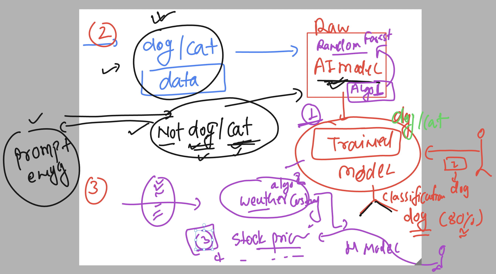
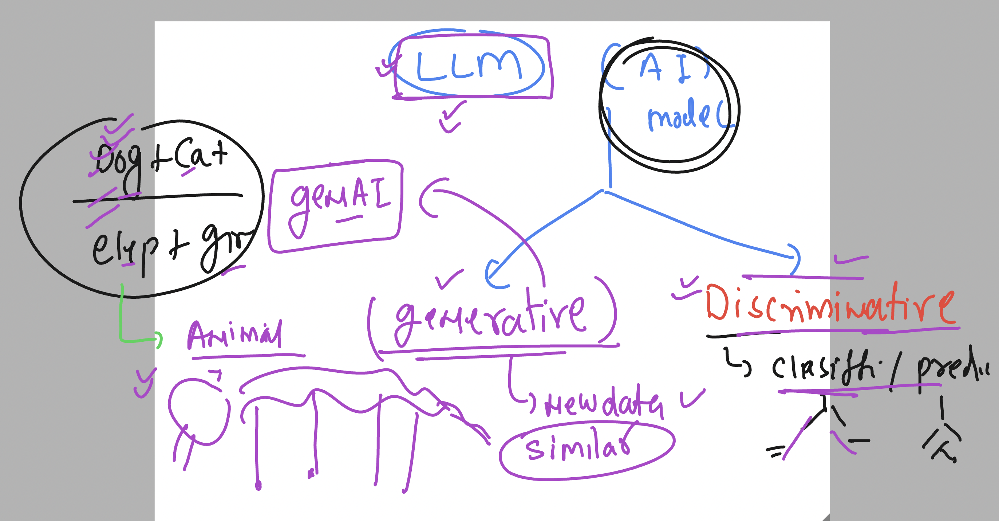
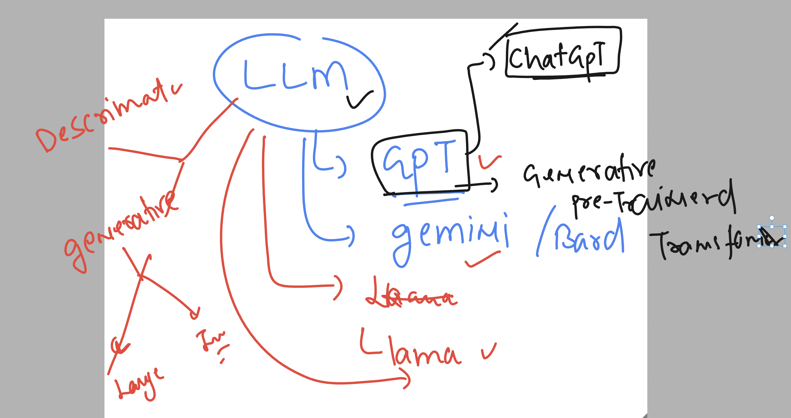

## basic understanding of prompting 

## Basic any AI model Understanding 

### more models for different types of expertise are required 

### basic understanding of LLM 

### Generative AI 

### LLM more info 

## Prompt engineering for LLM's

### Basic of prompt for GPT model 

## Good prompt components 

### more better example of good prompt 

