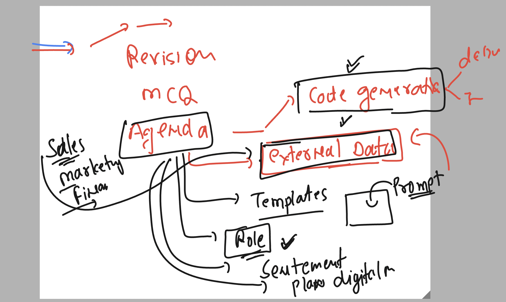
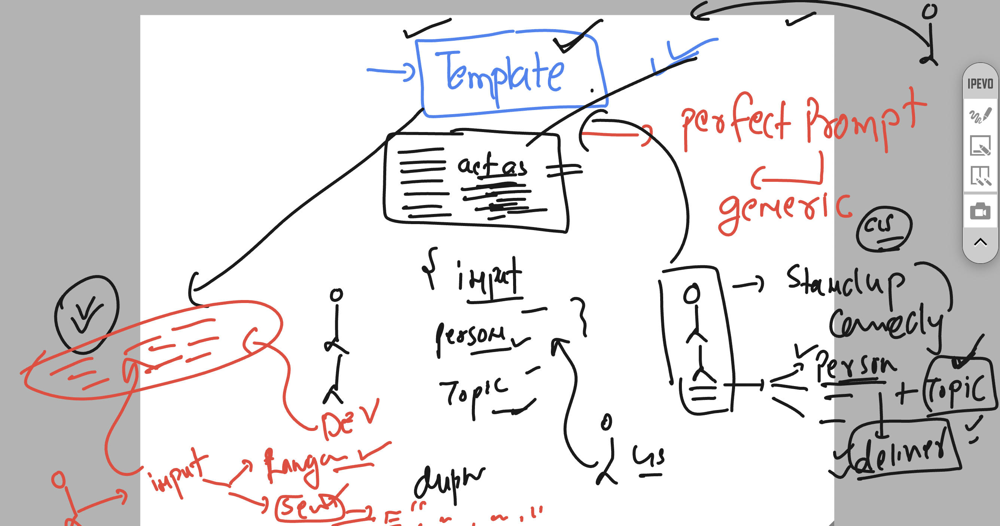
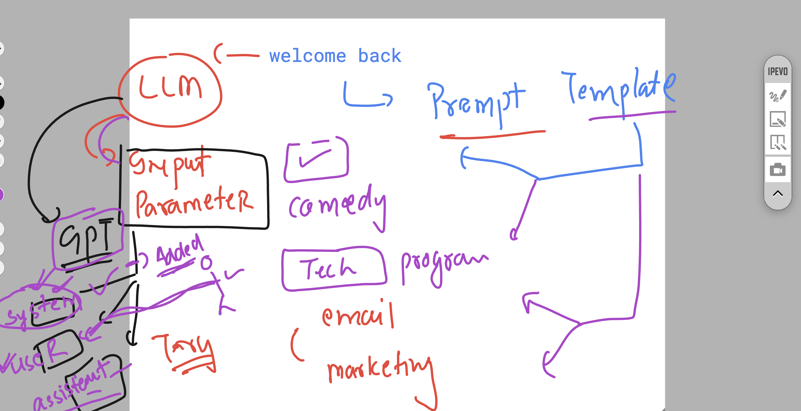
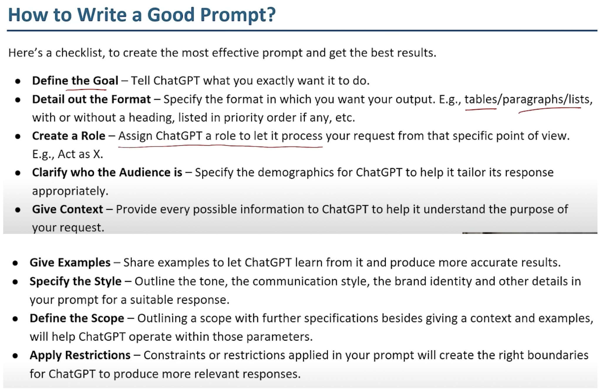

## Revision and target 



### anchor prompt example 

```
anchored prompt: 
" Write a short story in the style of classic fairy tale . For example , like 'Cinderella' , include a kind-hearted behaviour who overcomes adversity with the help of a magical being "

```

## templating in prompting 



### Understanding GPT model input parameters for templating 



### Template one 

```
act like a person who is doing pretty well in standup comedy on stage. your humor should be good and the style and tone of the request comedian.
This means you should observer their delivery style and tone and subject as well.
The jokes should be made funny as much as possible, as the disclaimer you can always use some understood details. anywhere you use a offnesive words , beep it out [F*ck].

Deliver the joke in Json format with a disclaimer and the joke is here as key.

input: *  
{"situation": "the topic of joke" , "actor":  " the comedian style "}

output: * 
{"disclaimer": "as an AI model ...", 
"joke": "a joke on the situation , delivered in the style of the actor..."}
```

## a good way to write prompt 



##

```
Instructions
---
Let's create a numeric list of 10 articles headlines that i could write about the topic: digital marketing ?
follow the output format given below


[output format]:
---
:- 10 Digital marketing strategies
:- The way to Boost your Business online


Rules
---
 Don't talk about SEO in the article titles 
avoid including any references to blogging  or email /SMS marketing with the headline generated
```